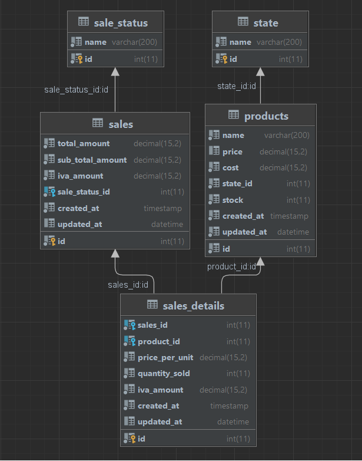

# PRUEBA TÉCNICA – BACKEND

Construir una solución basada en Microservicios para la gestión de productos de un almacén y su venta.


[Request](./docs/api.sales.postman_collection.json)
## Tecnologías

* [ASP.NET Core 6](https://docs.microsoft.com/en-us/aspnet/core/introduction-to-aspnet-core?view=aspnetcore-6.0)
* [Dapper](https://dapperlib.github.io/Dapper)
* [MariaDB](https://mariadb.org/)
* [FluentValidation](https://fluentvalidation.net)
* [MediatR](https://github.com/jbogard/MediatR)

>
 


## Creación del proyectos  : 
1. Crear solucion
> dotnet new sln

2. Crear proyecto Products

```
> cd src

> mkdir Products

> mkdir Sales

> cd Products

> dotnet new webapi -n Products.Api
> dotnet new classlib -n "Products.Application"
> dotnet new classlib -n "Products.Domain"
> dotnet new classlib -n "Sales.Infrastructure"
```
3. Crear proyecto Sales

```
> cd ..\Sales

> dotnet new webapi -n Sales.Api
> dotnet new classlib -n "Sales.Application"
> dotnet new classlib -n "Sales.Domain"
> dotnet new classlib -n "Sales.Infrastructure"
```

4. agregar los proyectos a la solucion:

```
> dotnet sln add "src\Products\Products.Api"
> dotnet sln add "src\Products\Products.Application"
> dotnet sln add "src\Products\Products.Domain"
> dotnet sln add "src\Products\Products.Infrastructure"
> dotnet sln add "src\Products\Sales.Api"
> dotnet sln add "src\Products\Sales.Application"
> dotnet sln add "src\Products\Sales.Domain"
> dotnet sln add "src\Products\Sales.Infrastructure"
```

 [Fuente](https://medium.com/@trphuongnam/how-to-structure-project-in-dotnet-core-by-command-line-f61b34bc7094)

 # Database:


#  
* [Base de datos Script SQL](./docs/sql/database.sql)
* [Base de datos backup](./docs/db_backup.sql)

# Postman Collection


## Visión general 

### Domain

Contine los modelos de las entidades de la base de datos

### Application

Esta capa contiene toda la lógica de la aplicación. Depende de la capa de dominio, pero no depende de ninguna otra capa o proyecto. Esta capa define interfaces que son implementadas por capas externas. Por ejemplo, si la aplicación necesita acceder a un servicio de notificación, se agregaría una nueva interfaz a la aplicación y se crearía una implementación dentro de la infraestructura.

### Infrastructure

Esta capa contiene clases para acceder a recursos externos como sistemas de archivos, servicios web, base de datos, etc. Estas clases deben basarse en interfaces definidas dentro de la capa de aplicación.
